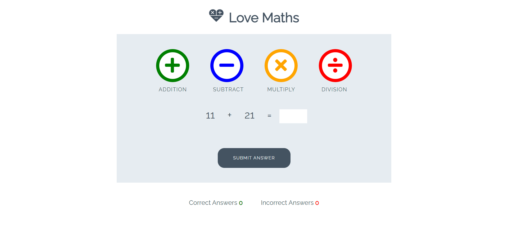

# Maths Game
to play this maths game you will need to open the bash terminal and type: python3 -m http.server

# About This Game
* This game is all about getting the answers right! try to get as many as you can. So far the user can try addition, subtraction, and multiplication. The division option will be out soon!
* This game has been made with the help of Code Institute.
  